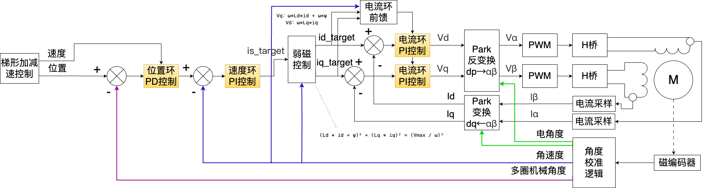
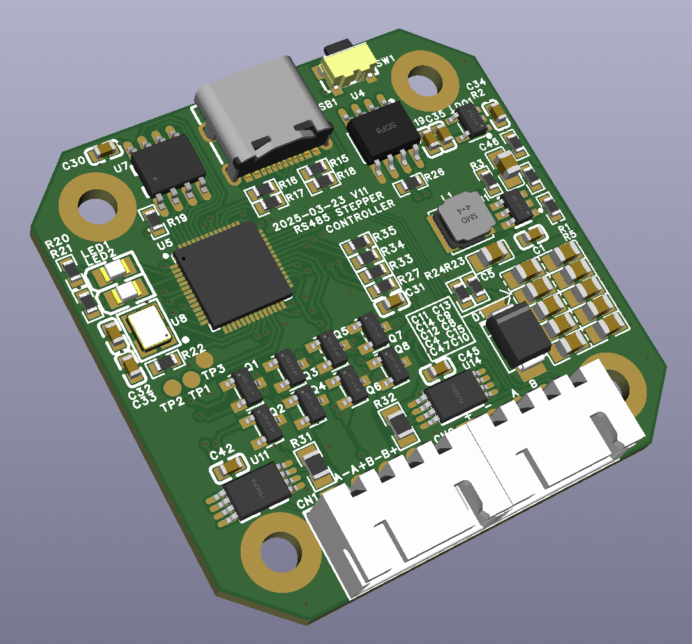
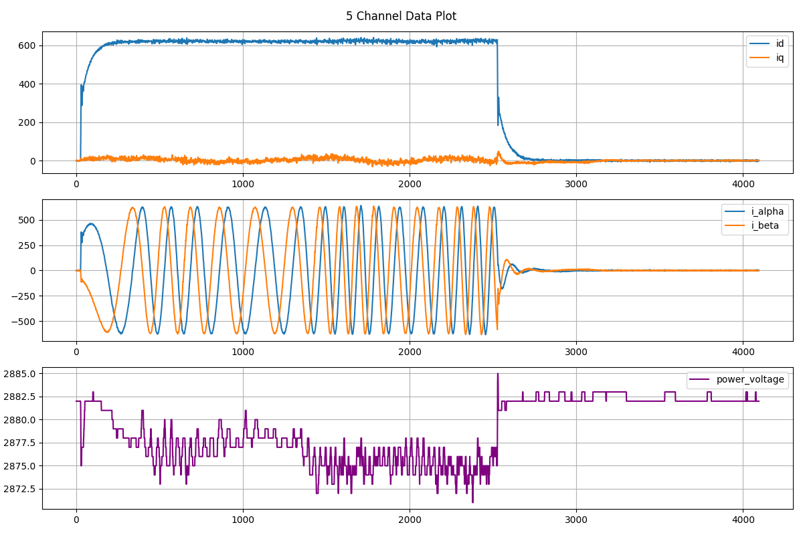
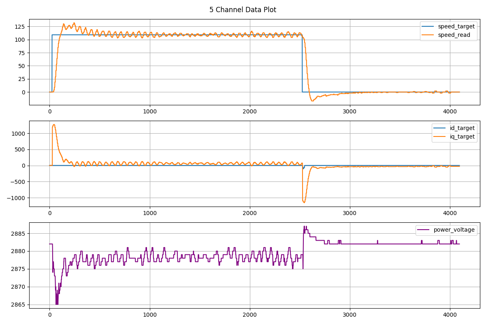
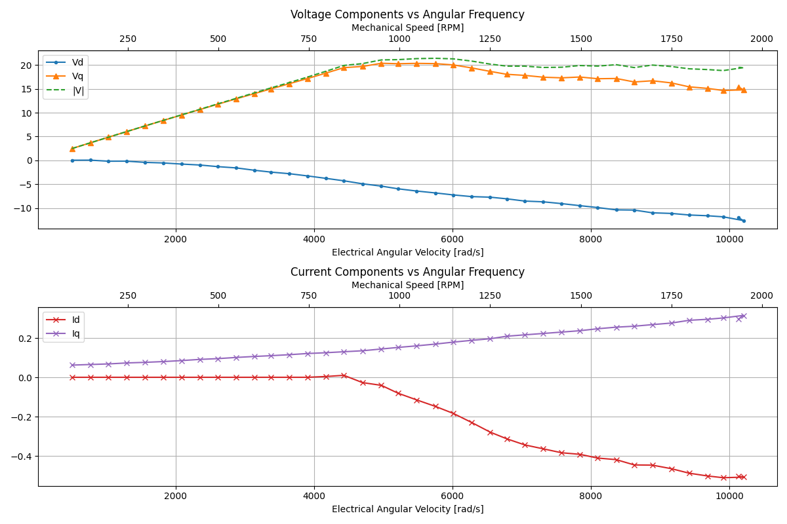
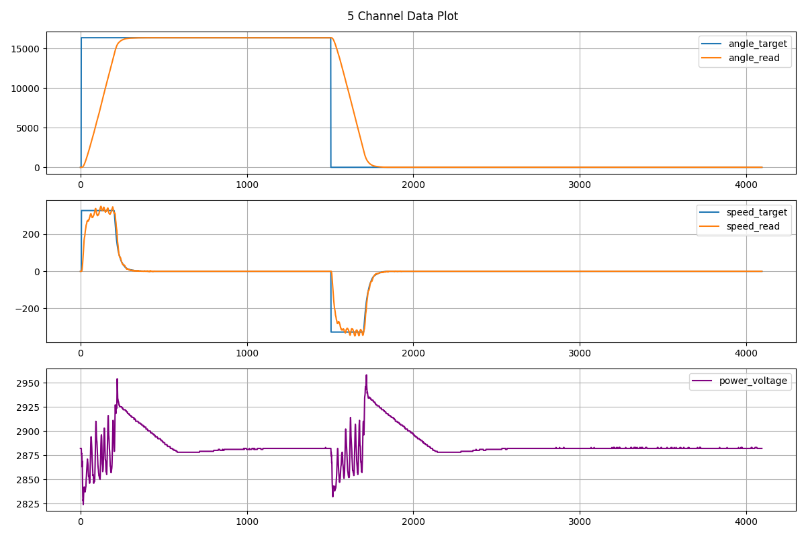
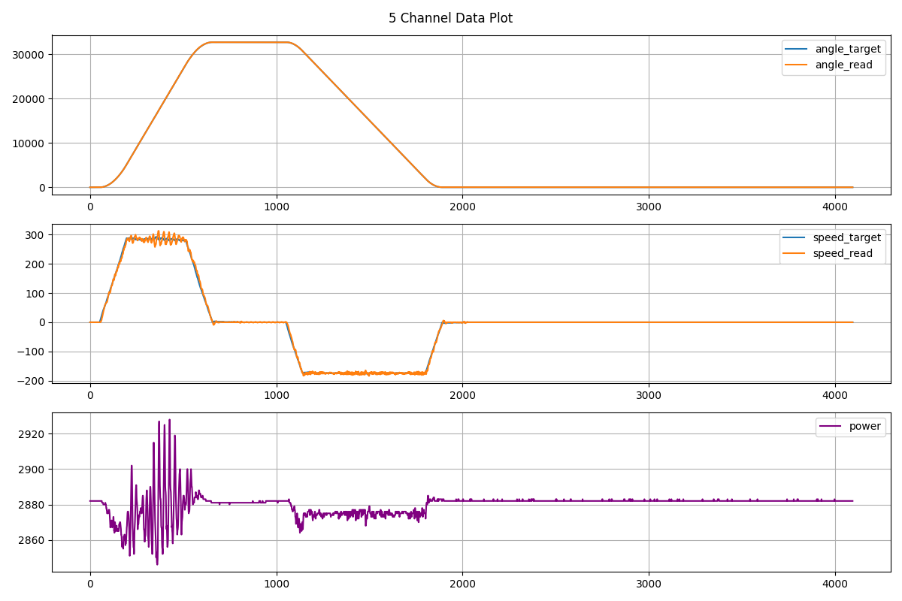

# 42闭环步进电机控制器



## 项目简介
基于RP2040的闭环步进电机控制器，支持RS485总线通信，提供完整的硬件设计、嵌入式固件及调试工具链。适用于3D打印机、机器人、CNC等需要高精度运动控制的场景。
（开发分支：删除梯形控制，改为通过上位机控制位置，通过485总线传输每个点的位置，支持多个电机联动）
### 核心特性
- **三环控制架构**：
  - 电流环（25kHz控制频率）
  - 速度环（5kHz控制频率） 
  - 位置环（5kHz控制频率）
- **高级控制功能**：
  - 磁场定向控制（FOC）
  - 梯形加减速算法
  - 弱磁控制策略
  - 前馈补偿机制
  - 多重保护（过压/欠压/过流/超速/过热/传感器失效）
- **通信接口**：
  - USB-C虚拟串口
  - RS485工业总线

## 硬件准备
### 物料清单
| 关键部件       | 规格说明                  |
|----------------|--------------------------|
| 主控芯片       | RP2040                   |
| 驱动芯片       | EG3013 ×4                |
| 电流采样       | INA240 ×2                |
| 编码器         | MT6816                   |
| 电源电路       | SGM61410 + ME6211        |

[完整BOM清单](hardware/BOM.xlsx)

### PCB设计

- 设计文件：
  - Gerber文件：`hardware/Gerber_PCB1_2025-03-23.zip`
  - 原理图：`hardware/SCH_Schematic1_2025-04-04.pdf`
  - 嘉立创EDA工程：`hardware/ProProject_485接口闭环步进电机控制器_V11_2025-04-04.epro`

### 焊接指南
1. **关键注意事项**：
   - R31/R32：使用10mΩ精密采样电阻（注意区分10mΩ与10MΩ）
   - R26：设计预留位，无需焊接
   - 焊接顺序：优先验证5V电源后再焊接R2

2. **通电前检测**：
   ```text
   1. 测量5V/3.3V对地阻抗，确保无短路
   2. 上电检测电压：5.0V±2%，3.3V±2%
   ```

## 开发环境搭建
### 软件依赖
- **工具链**：
  - 兼容Raspberry Pi Pico C/C++ SDK 1.5.1
  - 兼容Raspberry Pi Pico C/C++ SDK 2.2.0
  - 其他版本的没有测试过
  - 参考[官方文档](https://www.raspberrypi.com/documentation/microcontrollers/c_sdk.html)配置环境

- **Python依赖库**：
  ```bash
  pip install numpy matplotlib scikit-learn pyserial
  ```

### 固件编译流程
```bash
cd mcu
mkdir build && cd build
cmake ..
make
```
生成固件：`mcu.uf2`

## 快速开始
### 固件烧录方法
| 烧录场景   | 操作步骤                                                                 |
|------------|--------------------------------------------------------------------------|
| 首次烧录   | 连接USB → 上电 → 拖放UF2文件至虚拟磁盘                                    |
| 固件更新   | 方法1：按住SW1上电 → 拖放UF2文件<br>方法2：通过`prog`命令 → 拖放UF2文件  |

### 调试流程详解
1. **电机接线参考**：
   ```
   标准线序：
   A- A+ B- B+
   兼容线序：
   A- A+ B+ B-
   A+ A- B+ B-
   A+ A- B- B+

   B+ B- A+ A-
   B+ B- A- A+
   B- B+ A+ A-
   B- B+ A- A+
   ```

2. **连接USB**：
   - 在驱动板外接供电状态下，通过USB连接电脑
   - 系统将识别为CDC虚拟串口设备

3. **调试工具启动**：
   运行`python_tools/serial_debug.py`工具：
   ```bash
   python_tools % ./serial_debug.py
   使用方法: python serial_debug.py <串口设备路径>
   示例:
     python serial_debug.py /dev/ttyACM0
   可用设备列表:
     /dev/cu.wlan-debug - n/a
     /dev/cu.Bluetooth-Incoming-Port - n/a
     /dev/cu.usbmodem1201 - Pico
   ```
   **如果不需要绘图功能，也可以使用screen、minicom、putty等串口调试工具**

4. **成功连接提示**：
   ```bash
   python_tools % ./serial_debug.py /dev/cu.usbmodem1201
   成功连接 /dev/cu.usbmodem1201 @ 115200bps
   交互式串口终端（输入 'exit' 退出）
   ```

5. **基础指令**：
   - `help`：显示所有可用指令
   - `dump`：查看当前配置参数

6. **编码器校准**：
   - 执行`calibration`指令（建议空载运行）
   - 成功校准示例：
     ```bash
     Non-linearity error:
     Absolute: 40.52 counts
     Relative: 0.2484%
     ```
   - 非线性误差＞0.75%时需检查磁铁安装偏心问题

7. **电流环调试**：
   - 执行`curr_pi 1800`（带宽单位Hz，推荐1000-2000范围）
   - 输出示例：
     ```bash
     power voltage = 23.720V
     resistor A = 1.964 ohm, resistor B = 2.013 ohm
     inductance A = 4.093 mH, inductance B = 4.132 mH
     design_bandwidth = 1800.00, Suggest kp = 186489952, ki = 3606615
     ```
   - 通过`curr iq id`指令观察阶跃响应曲线  
     

8. **速度环调试**：
   - 调试步骤：
     1. 先关闭积分（Ki=0），逐步增加Kp至出现轻微震荡，取该值的60%-70%作为最终Kp
     2. 从Kp/50开始增加Ki，直至消除稳态误差且无超调
   - 参数调整策略：
     - 响应过慢 → Kp增加20%
     - 震荡/超调 → 减小Kp或增大Ki
     - 稳态误差大 → Ki增加50%
   - 示例曲线：  
     

9. **弱磁调试**：
   - 执行`psi`自动测量磁链参数
   - 高转速电压利用率优化：
     ```bash
     set Ld 0.0060
     set Lq 0.0041
     ```
   - 可视化工具：
     ```bash
     python_tools/plot_vd_vq.py
     ```
     示例曲线：  
     

10. **位置环调试**：
    - 调试方式与速度环类似，通常仅需P控制
    - 不稳定时可适量增加微分环节  
      

11. **梯形加减速调试**：
    - 使用`trap`指令测试加速度参数  
      

12. **参数保存**：
    - 调整参数完毕后，可使用save指令将参数保存到FLASH，否则掉电后，已修改的参数会丢失。

13. **典型参数**:
    - 下面是我用来调试双臂魔方机器人的电机参数（电流环带宽1400Hz），供参考。
    ```text
    set pos_kp 1100
    set pos_kd 0
    set speed_kp 100000
    set speed_ki 7000
    set curr_kp 147120528
    set curr_ki 2903040
    set psi 0.00445
    set Ld 0.0041
    set Lq 0.006
    set Rs 2.0
    set rs485_id 4 (四个分别设置为1、2、3、4)
    ```


## 调试指令参考
### 常用指令
| 指令            | 功能描述                          | 示例                |
|-----------------|----------------------------------|--------------------|
| `speed [KP KI]` | 速度环PID调试                    | `speed 90000 3000` |
| `pos [KP KD]`   | 位置环PID调试                    | `pos 1300 50`      |
| `trap [accel]`  | 梯形加减速测试                   | `trap 500`         |
| `ff [0/1]`      | 前馈控制开关                     | `ff 1`             |
| `dump`          | 显示所有系统参数                 | `dump`             |

### 完整指令列表
```bash
help    # 显示帮助信息
prog    # 进入USB Bootloader模式
reset   # 硬件复位
trap    # 梯形速度曲线测试
curr_pi # 电流环自动整定
psi     # 磁链参数测量
calibration # 编码器校准
485     # RS485通信测试
speed   # 速度环测试
curr    # 电流环测试
pos     # 位置环测试
ff      # 前馈控制开关
test    # [调试]临时功能
stat    # 系统状态显示
dump    # 参数导出
set     # 参数修改
save    # 参数保存到Flash
load    # 从Flash加载参数
```

## 开发指南
### 核心算法实现
1. **电流环控制**：
   ```c
   // foc.c
   void IN_RAM(on_pwm_wrap)(void) {
       // 坐标变换
       id_meas = Iα·cosθ + Iβ·sinθ
       iq_meas = -Iα·sinθ + Iβ·cosθ
       
       // 前馈补偿
       vd_ff = -ω·Lq·iq_target
       vq_ff = ω·(Ld·id_target + ψ)
   }
   ```

2. **梯形加速算法**：
   ```c
   // trapezoid.c
   void calculate_motion() {
       // 运动分段计算
       Ta = (v_max - v0)/a  // 加速段时间
       Tv = (S - Sa - Sd)/v_max  // 匀速段时间
       T = Ta + Tv + Td  // 总运动时间
   }
   ```

## 许可证
采用 **MIT开源协议**，允许商业用途。

---

## 版本历史
### 硬件修订
- 2025-03-14：初始版本
- 2025-03-23：优化驱动电路和电流采样方案
- 2025-04-04：将PWM下拉电阻从5.1KΩ调整为2.2KΩ，解决GPIO未初始化时的PWM信号电压问题

### 软件更新
- 2025-04-04：初始版本验证（电源/编码器/485/驱动桥/电流采样）
- 2025-05-06：完成所有控制环路及高级功能（三环控制/梯形加减速/弱磁/前馈补偿）
```
